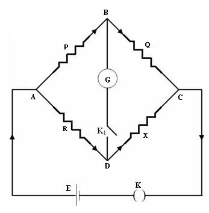
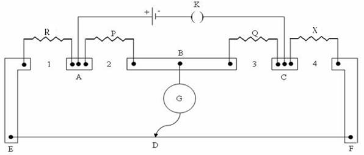

### Theory
A Carey foster bridge is principally same as a meter bridge, which consists of four resistances P, Q, R and X that are connected to each other as shown in figure 1.

<table>
  <tr>
    <td align="center"></td>
  </tr>
  <tr>
    <td align="centre">Figure 1: Wheatstone's bridge </td>
  </tr>
</table>

In this circuit G is the galvanometer and E is a lead accumulator and K1and K are the galvanometer key and accumulator key respectively. If the values of the resistances are adjusted so that no current flows through the galvanometer, and if any of three resistances P,Q,R and X are known, the unknown resistance can be determined using the relationship,

$$\frac{P}{Q}=\frac{R}{X}$$

The Carey foster bridge is used to measure the difference between two nearly equal resistances and knowing the value of one, the other can be calculated. In this bridge, the end resistances are eliminated in calculation. Which is an advantage and hence it can conveniently used to measure a given resistance.

Let P and Q be the equal resistances connected in the inner gaps 2 and 3, the standard resistance R is connected in gap 1 and the unknown resistance X is connected in the gap 4.Let l1 be the balancing length ED measured from the end E. By whetstone's principle,

$$\frac{P}{Q}=\frac{R+a+l_{1}\rho}{X+b+(100-l_{1})\rho}..........(1)$$

Where, a and b are the end corrections at the ends E and F, and  is the resistance per unit length of the bridge wire.
If the experiment is repeated with X and R interchanged and if l2 is the balancing length measured from the end E,

$$\frac{P}{Q}=\frac{R+a+l_{2}\rho}{X+b+(100-l_{2})\rho}..........(2)$$

From equation (1) & (2)

$$X=R+\rho(l_{1}-l_{2})..........(3)$$

Let l1' and l2' are the balancing lengths when the above experiment is done with a standard resistance r (say 0.1) in the place of R and a thick copper strip of zero resistance in place of X

From equation (3),

$$0=r+\rho(\acute{l_{1}}-\acute{l_{2}})$$

Or $$\rho=\frac{r}{\acute{l_{1}}-\acute{l_{2}}}$$
If X1 and X2 are the resistance of a coil at temperatures t1oc and t2oc, the temperature coefficient of resistances is given by the equation,

$$\alpha=\frac{X_{2}-X_{1}}{X_{1}t_{2}-X_{2}t_{1}}$$

Also, if X0 and X100 are the resistance of the coil at 0oc and 100oc,

$$\alpha=\frac{X_{100}-X_{0}}{X_{0}\times 100}$$

